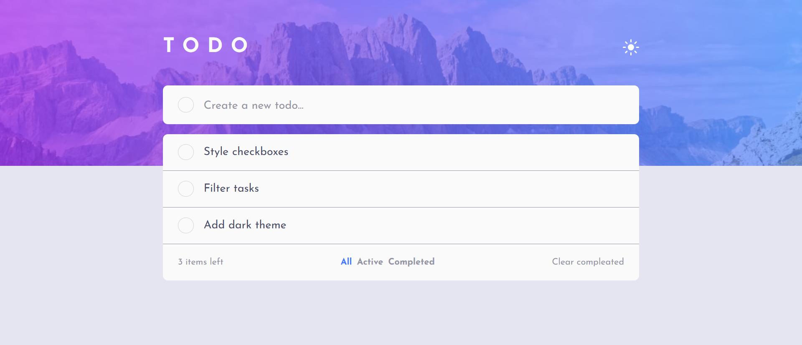

# Frontend Mentor - Todo app solution

This is a solution to the [Todo app challenge on Frontend Mentor](https://www.frontendmentor.io/challenges/todo-app-Su1_KokOW). Frontend Mentor challenges help you improve your coding skills by building realistic projects. 

## Table of contents

- [Overview](#overview)
  - [The challenge](#the-challenge)
  - [Screenshot](#screenshot)
  - [Links](#links)
- [My process](#my-process)
  - [Built with](#built-with)
  - [What I learned](#what-i-learned)
  - [Useful resources](#useful-resources)
- [Author](#author)


## Overview

### The challenge

Users should be able to:

- View the optimal layout for the app depending on their device's screen size
- See hover states for all interactive elements on the page
- Add new todos to the list
- Mark todos as complete
- Delete todos from the list
- Filter by all/active/complete todos
- Clear all completed todos
- Toggle light and dark mode
- **Bonus**: Drag and drop to reorder items on the list


### Screenshot




### Links

- Solution URL: (https://www.frontendmentor.io/solutions/responsive-and-functional-solution-using-css-grid-and-flexbox-K0koywL-sy)
- Live Site URL: (https://daniilgurski.github.io/FM-todo/)


## My process

### Built with

- Semantic HTML5 markup
- BEM 
- CSS custom properties
- Flexbox
- CSS Grid
- Mobile-first workflow


### What I learned

I learned more about the template tag, which is perfect for adding elements or creating them via js. I personally made a copy of the task-item element, which is a visual representation of the task added by the user.
```html
  <template class="task-item-template"> 
    <li class="task-item task-block">
      <div class="task-content">
          <input type="checkbox" id="task-checkbox" class="task-content__checkbox">
          <label for="" class="task-content__task-label">
          </label>
      </div>
  
      <button class="task-item__remove-task-btn button" id="remove-task-btn">
           
      </button>
    </li>
  </template>
```

The hardest part of styling this project for me was creating my own checkboxes,
their positioning and their gradient, rounded borders. Basically all the magic of these checkboxes is provided by the hidden regular checkbox as you can see below: 
```css
.task-content__checkbox {
    width: 0;
    opacity: 0;
}


.task-content__task-label::before {
    content: "";

    width: var(--_checkbox-size);
    height: var(--_checkbox-size);

    border-radius: 50%;
    border: solid 1px var(--_checkbox-border-clr);
}


.task-content__task-label:hover:before {
    /* 
    we do gradient border this way, because only 
    box's backgrounds are cliped to appropriate radius curve but 
    not the border-image.
    */
    border-color: transparent;
    background-image: 
    linear-gradient(var(--_task-bg-clr), var(--_task-bg-clr
    )),
    linear-gradient(hsl(192, 100%, 67%), hsl(280, 87%, 65%));

    background-origin: border-box;
    background-clip: content-box, border-box;
}


.task-content__checkbox:checked + .task-content__task-label::before {
    content: "";

    width: var(--_checkbox-size);
    height: var(--_checkbox-size);

    border-radius: 50%;
    border: none;

    background-image: 
    url("./images/icon-check.svg"),
    linear-gradient(hsl(192, 100%, 67%), hsl(280, 87%, 65%));
    
    background-position: center;
    background-repeat: no-repeat;
}


.task-content__checkbox:checked + .task-content__task-label {
    text-decoration: line-through;
    color: var(--_task-secondary-clr);
}
```

In this project, as I wanted to do, I delved more into working with local storage. It was mostly used for creating, filtering and saving tasks added to the list, but also for saving the theme of the page. For example, this is how I created a task object used for further manipulations: 
```js
function createTask() {
    const inputValue = document.getElementById("task-input").value.trim();
    
    if (inputValue === "") {
        return
    }

    const newTask = {[inputValue]: {
        id: uniqueTaskId += 1,
        checked: false
    }}
    
    taskListData.push(newTask);
    localStorage.setItem("total-tasks-created", uniqueTaskId);
    localStorage.setItem("task-list", JSON.stringify(taskListData)) 

    appendTask(newTask, inputValue);
}
```


### Useful resources

- [FollowAndrew](https://youtu.be/NfW_5Y1RZQ4?feature=shared) - Helped with creating custom checkboxes in css.

- [FollowAndrew](https://youtu.be/sgJMeiV0tyc?feature=shared) - About template tag in html

- [Leanne R](https://youtu.be/k-kyiUuRxkQ?feature=shared) - Showed how to create rounded gradient borders in css.

- [Dcode](https://youtu.be/AUOzvFzdIk4?feature=shared) - Basics of local storage

- [Max Programming](https://youtu.be/U693xrQKFy4?feature=shared) - Local storage in pracitce.

- [Web Accessibility Education](https://youtu.be/38JDscMbB4I?feature=shared) - Aria attributes in html


## Author
- Frontend Mentor - [@DaniilGurski](https://www.frontendmentor.io/profile/DaniilGurski)

